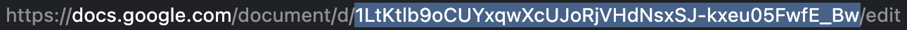
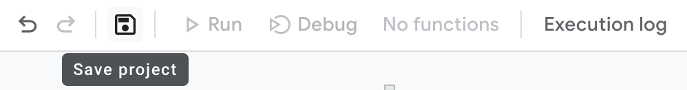
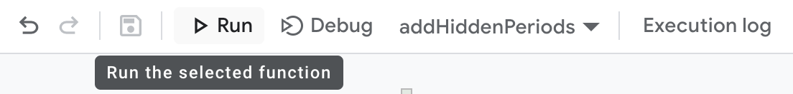

# Anti AI Detection Script

This script makes AI generated content in a Google doc **completely undetectable** by all AI content detectors and does so without changing the words.
It is useful because a teacher using an AI detection tool will not be able to catch you if you are submitting something like an essay written by ChatGPT.
The script randomly adds "hidden" periods (periods with a font size of 1 and a foreground color of white) after words in sentences.
This breaks up your sentences into smaller sentences that make no sense, and therefore AI detectors believe it must have been entirely written by a human.
This process can also be done manually by copying and pasting "hidden" periods throughout the text as the script does.
However, this becomes very tedious for content longer than a couple of sentences, and once you get the script set up, it becomes very easy to do this to any document very quickly.

## Tutorial

1. Create a Google Apps Script in your Google Drive.

2. Copy and paste the following code into your script.

```javascript (google script is basically just old javascript)
function addHiddenPeriods() {
  var docId = "1LtKtlb9oCUYxqwXcUJoRjVHdNsxSJ-kxeu05FwfE_Bw";
  var doc = DocumentApp.openById(docId);
  var body = doc.getBody();
  var text = body.getText();
  var newText = body.editAsText();
  var count = 0;
  for (var i = 0; i < text.length; i++) {
    var char = text.charAt(i);
    if (char == " " && Math.random() < 0.3) {
      var index = i + count;
      newText.insertText(index, ".");
      newText.setForegroundColor(index, index, "#FFFFFF");
      newText.setFontSize(index, index, 1);
      count++;
    }
  }
}
```

3. Change the the value of docId to your document id which can be found in the document url.



4. Save the project by clicking the save icon.



5. Run the function by clicking the run button.



6. **That's it!** Once you give permissions to the script as prompted when you click run for the first time, the script will run and do its thing. Now if you want to do it to another document, you only have to do steps 3-5.

**Note**: if you don't want the blue underlines to show in the Google doc, turn off grammar suggestions.